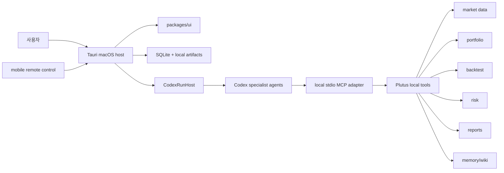

<p align="center">
  
  
  
  
  
</p>

<h1 align="center">Plutus</h1>

<p align="center">
  <a href="./README.md">en</a>
</p>

<p align="center">
  
</p>

Plutus는 macOS를 중심으로 동작하는 로컬 우선 투자 리서치 워크스페이스입니다. Codex 기반 멀티 에이전트 팀이 시장 데이터 수집, 포트폴리오 점검, 백테스트, 리스크 리뷰, 보고서 작성을 나누어 수행하고, 사용자는 그 결과를 근거와 함께 검토합니다.

> MVP의 경계는 명확합니다. Plutus는 리서치, 시뮬레이션, 의사결정 지원 도구이며 라이브 주문 실행이나 자율 매매를 하지 않습니다.

## 왜 Plutus인가

투자 리서치 도구는 보통 세 가지 중 하나를 포기합니다. 데이터와 판단 근거가 흩어지거나, 자동화가 블랙박스가 되거나, 개인 포트폴리오와 인증 정보가 외부 서비스에 과도하게 의존합니다.

Plutus는 반대로 설계합니다.

- **로컬 우선**: macOS 호스트가 SQLite, 아티팩트, 감사 로그, Codex 런타임의 기준점입니다.
- **에이전트 팀 기반**: 리서처, 데이터 애널리스트, 백테스터, 리스크 리뷰어, 리포터가 역할별로 분리됩니다.
- **근거 중심**: 모든 제안은 데이터 신선도, 가정, 리스크, 출처, 추천 범주를 함께 남깁니다.
- **실행 경계**: MVP는 관찰, 추가 조사, 리밸런싱 후보, 전략 후보, 리스크 경고, 무조치 판단까지만 다룹니다.
- **한국어/영어 UI 고려**: 앱 chrome, 보고서, 메모리, 위키 요약이 locale 계약을 공유합니다.

## 제품 표면

| 영역                  | 설명                                                                                                                            |
| --------------------- | ------------------------------------------------------------------------------------------------------------------------------- |
| macOS host app        | Tauri 2 기반 로컬 앱입니다. 포트폴리오 상태, Codex 런타임, 로컬 도구, 감사 로그의 source of truth를 가집니다.                   |
| Web preview           | Codex가 브라우저에서 UI와 반응형 레이아웃을 검증할 수 있는 개발 표면입니다.                                                     |
| Mobile remote control | 모바일은 독립 데이터베이스가 아니라 Mac 호스트를 제어하고 진행 상황을 보는 paired controller입니다.                             |
| Local MCP adapter     | Codex 에이전트가 시장 데이터, 포트폴리오, 백테스트, 리스크, 리포트, 메모리, 위키 도구를 안전하게 호출하는 stdio MCP 표면입니다. |
| Memory and wiki       | Plutus 소유 메모리 어댑터와 로컬 Markdown wiki가 장기 리서치 맥락을 관리합니다.                                                 |

## 아키텍처 한눈에 보기



## Monorepo 구성

| 경로                         | 역할                                                                 |
| ---------------------------- | -------------------------------------------------------------------- |
| `apps/tauri`                 | macOS 호스트 앱과 모바일 remote-control shell의 Tauri 표면           |
| `apps/web-preview`           | 동일한 route/UI를 브라우저에서 검증하는 개발 앱                      |
| `packages/domain`            | Zod 스키마, TypeScript 타입, ID/enum/domain invariant                |
| `packages/data`              | provider adapter, 심볼 해석, candle normalization, freshness warning |
| `packages/agents`            | Codex run host, agent workflow, structured output, guardrail         |
| `packages/backtest`          | 전략 스펙 검증, long-only simulation, metric/report model            |
| `packages/local-tools`       | Plutus first-party local tool namespace와 audit hook                 |
| `packages/local-mcp-adapter` | Codex에 허용된 local tool을 노출하는 stdio MCP adapter               |
| `packages/command-client`    | Tauri와 web preview가 공유하는 typed command client                  |
| `packages/remote-control`    | pairing, encrypted session message, remote command schema            |
| `packages/memory`            | Mem0-backed memory adapter, recall, retention, sensitivity filtering |
| `packages/wiki`              | 로컬 Markdown wiki, curator workflow, revision/diff/revert           |
| `packages/test-fixtures`     | unit/integration/e2e/agent harness용 deterministic fixture           |

## 시작하기

필수 조건:

- Node.js `>=22.13`
- pnpm `11.0.0`
- Rust/Tauri 개발 환경

```bash
pnpm install
pnpm dev:web
```

macOS 앱으로 실행하려면:

```bash
pnpm dev:tauri
```

## 검증 명령

자주 쓰는 루트 명령입니다.

```bash
pnpm typecheck
pnpm test:unit
pnpm test:e2e:ui
pnpm --filter @plutus/tauri tauri build
```

전체 acceptance 흐름은 다음 명령을 기준으로 합니다.

```bash
pnpm test:acceptance
```

## 문서 읽는 순서

처음 보는 사람은 아래 순서로 읽으면 프로젝트 경계와 구현 방향을 빠르게 잡을 수 있습니다.

1. [`prd/README.md`](./prd/README.md): 제품 의도, MVP 경계, 핵심 결정
2. [`spec/README.md`](./spec/README.md): 구현 스펙, 패키지 책임, local tool 표면
3. [`spec/00-system-architecture.md`](./spec/00-system-architecture.md): 전체 아키텍처와 non-negotiable boundary
4. [`spec/08-codex-development-automation.md`](./spec/08-codex-development-automation.md): Codex 작업자와 검증 스크립트 계약
5. [`AGENTS.md`](./AGENTS.md): 이 저장소에서 에이전트가 작업을 시작하는 방식

## 작업 원칙

- `main`은 보호되는 통합 브랜치입니다.
- 작업은 이슈 단위 topic branch와 별도 worktree에서 진행합니다.
- PR은 검증 결과, 변경 영역, 연결 이슈, 후속 작업을 포함해야 합니다.
- 완료된 PR은 squash merge를 기본으로 합니다.
- provider credential은 raw key/secret을 UI state나 config에 남기지 않고 secure reference만 보관합니다.

## 현재 상태

Plutus는 MVP 구현이 진행 중인 저장소입니다. 리서치/시뮬레이션/의사결정 지원 기능을 먼저 완성하고, 라이브 거래 실행은 별도 PRD가 열리기 전까지 범위 밖으로 둡니다.
