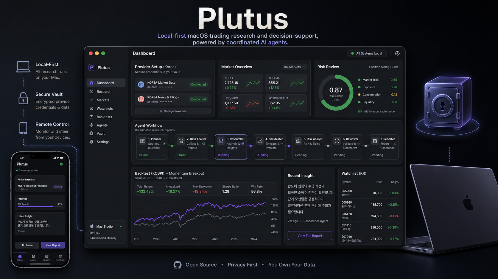
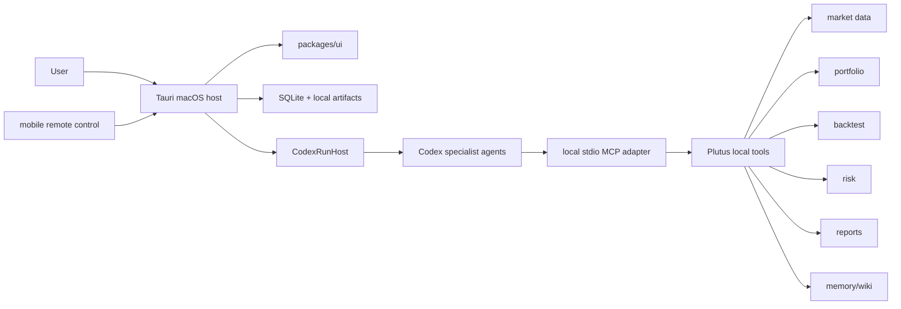

<p align="center">
  
  
  
  
  
</p>

<h1 align="center">Plutus</h1>

<p align="center">
  <a href="./README.ko.md">ko</a>
</p>

<p align="center">
  
</p>

Plutus is a local-first trading research workspace centered on a macOS host. It coordinates Codex-powered specialist agents for market research, portfolio review, backtesting, risk analysis, and report generation, while keeping the user in control of the final decision.

> The MVP boundary is explicit: Plutus is for research, simulation, and decision support. It does not place live orders or perform autonomous trading.

## Why Plutus

Most trading research tools force an uncomfortable tradeoff: evidence is scattered, automation becomes opaque, or portfolio and credential data depend too heavily on external services.

Plutus is designed in the opposite direction.

- **Local-first**: the macOS host owns SQLite state, local artifacts, audit logs, and the Codex runtime boundary.
- **Agent-team workflow**: researchers, data analysts, backtesters, risk reviewers, and reporters work as separate specialists.
- **Evidence-centered output**: every recommendation carries assumptions, data freshness, risk notes, source references, and a recommendation category.
- **Clear execution boundary**: MVP outputs are limited to observation, additional research, rebalance candidates, strategy candidates, risk warnings, and no-action calls.
- **Korean and English product support**: app chrome, reports, memory summaries, and wiki summaries share one locale contract.

## Product Surfaces

| Surface               | Description                                                                                                                           |
| --------------------- | ------------------------------------------------------------------------------------------------------------------------------------- |
| macOS host app        | A Tauri 2 local app that owns portfolio state, Codex runtime, local tools, and the audit log.                                         |
| Web preview           | A browser development surface where Codex can verify UI and responsive layouts.                                                       |
| Mobile remote control | A paired controller and viewer for the Mac host, not an independent source-of-truth database.                                         |
| Local MCP adapter     | A stdio MCP surface that lets Codex agents safely call Plutus market data, portfolio, backtest, risk, report, memory, and wiki tools. |
| Memory and wiki       | A Plutus-owned memory adapter and local Markdown wiki keep long-running research context auditable.                                   |

## Architecture At A Glance



## Monorepo Layout

| Path                         | Responsibility                                                                      |
| ---------------------------- | ----------------------------------------------------------------------------------- |
| `apps/tauri`                 | Tauri surface for the macOS host app and mobile remote-control shell.               |
| `apps/web-preview`           | Browser app for validating the same route and UI surfaces during development.       |
| `packages/domain`            | Zod schemas, TypeScript types, IDs, enums, and domain invariants.                   |
| `packages/data`              | Provider adapters, symbol resolution, candle normalization, and freshness warnings. |
| `packages/agents`            | Codex run host, agent workflows, structured outputs, and guardrails.                |
| `packages/backtest`          | Strategy spec validation, long-only simulation, metrics, and report models.         |
| `packages/local-tools`       | First-party Plutus local tool namespaces and audit hooks.                           |
| `packages/local-mcp-adapter` | Stdio MCP adapter exposing approved local tools to Codex.                           |
| `packages/command-client`    | Typed command client shared by Tauri and web preview.                               |
| `packages/remote-control`    | Pairing, encrypted session messages, and remote command schemas.                    |
| `packages/memory`            | Mem0-backed memory adapter, recall, retention, and sensitivity filtering.           |
| `packages/wiki`              | Local Markdown wiki workflows, revisions, diffs, and revert support.                |
| `packages/test-fixtures`     | Deterministic fixtures for unit, integration, E2E, and agent harness tests.         |

## Getting Started

Requirements:

- Node.js `>=22.13`
- pnpm `11.0.0`
- Rust and the Tauri development toolchain

```bash
pnpm install
pnpm dev:web
```

Run the macOS app:

```bash
pnpm dev:tauri
```

## Verification

Common root commands:

```bash
pnpm typecheck
pnpm test:unit
pnpm test:e2e:ui
pnpm --filter @plutus/tauri tauri build
```

The broader acceptance flow is:

```bash
pnpm test:acceptance
```

## Documentation Path

If you are new to the project, start here:

1. [`prd/README.md`](./prd/README.md): product intent, MVP boundaries, and core decisions
2. [`spec/README.md`](./spec/README.md): implementation specs, package ownership, and local tool surfaces
3. [`spec/00-system-architecture.md`](./spec/00-system-architecture.md): architecture and non-negotiable boundaries
4. [`spec/08-codex-development-automation.md`](./spec/08-codex-development-automation.md): Codex worker and verification contracts
5. [`AGENTS.md`](./AGENTS.md): how agents should start work in this repository

## Working Principles

- `main` is the protected integration branch.
- Work happens in issue-sized topic branches and isolated worktrees.
- PRs should include verification results, changed areas, linked issues, and known follow-ups.
- Completed PRs use squash merge by default.
- Provider credentials must never leave raw keys or secrets in UI state or config; store only secure references.

## Current Status

Plutus is an MVP-stage repository. The first priority is research, simulation, and decision support. Live trade execution remains out of scope until a separate PRD opens that boundary.
