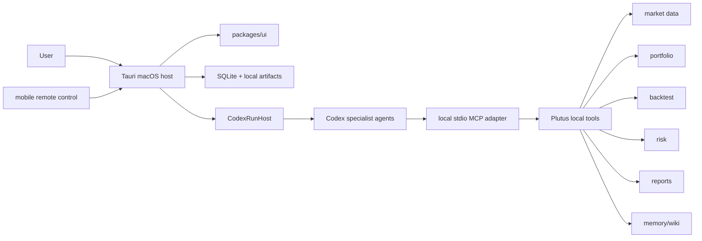

# Architecture

Plutus is a local-first macOS research workstation. A user creates portfolios and watchlists, asks natural-language research questions, runs Codex-controlled specialist workflows, and receives risk-reviewed run cards and reports.

The same architecture lets the user control the Mac host from mobile without requiring a hosted backend.

## Boundaries

- MVP is research, simulation, and decision support only.
- No live trade execution, broker order placement, or autonomous capital allocation.
- All recommendations must include evidence, assumptions, data freshness, risk caveats, and one recommendation category.
- Provider secrets, raw Codex environment variables, and unrestricted agent prompts stay inside the local app runtime.
- Agents access product data only through first-party local tools and structured inputs.
- MVP must run without PostgreSQL, Redis, BullMQ, S3, a hosted API server, or managed cloud services.
- macOS is the source-of-truth host for MVP. Mobile is a paired remote controller, not an independent sync peer.

## System View



## Monorepo Layout

```text
plutus/
  apps/
    tauri/
      src/
      src-tauri/
        src/
          commands/
          runtime/
          storage/
          secure-store/
          remote_control/
    web-preview/
      src/
      tests/
  packages/
    domain/
    data/
    agents/
    backtest/
    memory/
    wiki/
    local-tools/
    local-mcp-adapter/
    command-client/
    remote-control/
    ui/
    test-fixtures/
  tests/
    e2e/
```

## Package Responsibilities

| Package/App                  | Responsibility                                                                                                        |
| ---------------------------- | --------------------------------------------------------------------------------------------------------------------- |
| `apps/tauri`                 | macOS host shell and mobile remote-control shell; responsive React webview; native capability bridge; local commands. |
| `apps/web-preview`           | Browser preview using the same frontend route set as Tauri for development and Codex in-app browser verification.     |
| `packages/domain`            | Zod schemas, TypeScript types, domain invariants, ID formats, and enum contracts.                                     |
| `packages/data`              | Provider adapters, symbol resolution, candle normalization, and freshness warnings.                                   |
| `packages/agents`            | `CodexRunHost`, workflow planner, structured output schemas, role prompts, guardrails, and local event stream.        |
| `packages/backtest`          | Strategy spec validation, long-only simulation, metrics, chart models, and report data models.                        |
| `packages/memory`            | Mem0-backed automatic memory capture, recall, sensitivity filtering, retention, and user controls.                    |
| `packages/wiki`              | Local Markdown wiki storage, curator workflows, revision history, diffs, and revert support.                          |
| `packages/local-tools`       | MCP-shaped local namespace tools with per-agent allowlists and audit hooks.                                           |
| `packages/local-mcp-adapter` | Local stdio MCP adapter exposing approved local tool namespaces to Codex.                                             |
| `packages/command-client`    | Typed local command client shared by Tauri and web preview.                                                           |
| `packages/remote-control`    | Pairing protocol, encrypted session messages, remote command schemas, and host/mobile event contracts.                |
| `packages/ui`                | Webview-safe UI primitives, chart wrappers, design tokens, translation catalogs, and locale-aware formatting helpers. |
| `packages/test-fixtures`     | Deterministic MVP seed fixtures shared by unit, integration, E2E, Tauri smoke, and agent harness tests.               |

## Runtime Shape

The Tauri Rust side owns local capabilities and exposes typed commands to the React webview. It stores local state in SQLite, writes artifacts to the app data directory, emits local runtime events to the webview, and uses platform secure storage for secrets.

`packages/agents` owns Codex SDK integration. The rest of Plutus calls `CodexRunHost` through product-level operations rather than calling Codex directly.

The Mac host starts a local stdio MCP adapter that exposes approved first-party tool namespaces to Codex. Each tool call is delegated back to the local router with the active run context, role allowlists, schema validation, audit logging, and source metadata.
